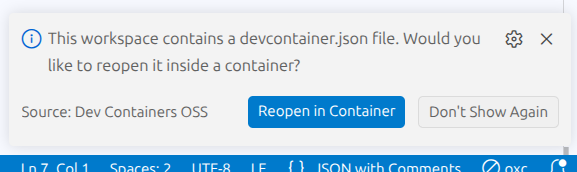

# Dev Containers OSS

For VSCodium and other VS Code-based IDEs that don't ship their own dev containers support. Resembles Microsoft's [official extension](https://marketplace.visualstudio.com/items?itemName=ms-vscode-remote.remote-containers) as close as reasonable (see [differences](#differences-to-the-official-extension) below).

**PLEASE NOTE:** This uses proposed VS Code APIs (just like the official extension), which are subject to change at any time. Which means that any IDE update may cause this extension to stop working.

## Getting started

Requirements are the same as official, see: https://code.visualstudio.com/docs/devcontainers/containers#_system-requirements

Don't forget to make your SSH key available if you want to commit through the UI: https://code.visualstudio.com/remote/advancedcontainers/sharing-git-credentials#_using-ssh-keys

### Windows

Put your projects on the WSL file system. and then just open them from there. No WSL extension needed.

Native file system actually works too but you would have a _really_ bad time with it. Here are some numbers from running `pnpm install` on a project:

```
Native file system WITHOUT dev container: ~29s
Native file system with devcontainer: ~4m15s
WSL file system with devcontainer: ~20s
```

## Differences to the official extension

- No devcontainer config creation through menus ([as e.g. shown here](https://code.visualstudio.com/docs/devcontainers/tutorial#_get-the-sample)). `.devcontainer/devcontainer.json` has to be created manually, like for example:

```json
{
  // Available base images: https://github.com/devcontainers/images/tree/main/src
  "image": "mcr.microsoft.com/devcontainers/javascript-node",

  // Official feature browser: https://containers.dev/features
  "features": {
    "ghcr.io/devcontainers-extra/features/direnv:1": {}
  },

  "customizations": {
    "vscode": {
      "settings": {
        "terminal.integrated.defaultProfile.linux": "zsh"
      },
      // Extensions that don't work if not installed within the devcontainer
      "extensions": [
        "ms-playwright.playwright",
        "eamodio.gitlens",
        "oxc.oxc-vscode"
      ]
    }
  }
}
```

[See my custom feature repo here](https://github.com/s-h-a-d-o-w/devcontainers-features) for a more elaborate example suitable for web development. pnpm store and zsh history shared across containers and customized shell.

- Features are limited to the basics - conveniently building/rebuilding and connecting to containers through the connect menu (bottom left corner) and notifications.



- No container connection until most of the setup is done. vscode is more eager here, which I don't think is good. Because if you have a post create script that takes a bit to finish, the official extension connects you before the environment is ready.

### SSH fallback

Is automatically used if your IDE version doesn't offer the necessary APIs for "native" dev container connection.

Requires the extension `jeanp413.open-remote-ssh`. You will be prompted for installation if you don't have it already installed.

Also, a local SSH public key is needed (e.g., `~/.ssh/id_ed25519.pub` or `~/.ssh/id_rsa.pub`). If you only have private one, use e.g. `ssh-keygen -y -f ~/.ssh/id_rsa > ~/.ssh/id_rsa.pub`.

## Troubleshooting

- Docker permissions: Ensure your user can run Docker commands without sudo, and that `docker` is available globally.

## Acknowledgements

This extension (in particular the SSH fallback) is very loosely based on: https://github.com/DDorch/codium-devcontainer
